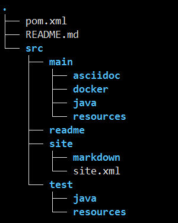
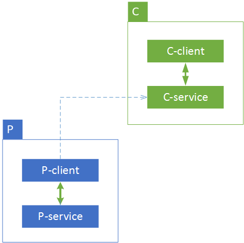

# OSS-ARCHETYPE-MICRO-SERVICE

* [简介](#简介)
* [使用](#使用)
* [项目架构](#项目架构)
  * [目录结构](#目录结构)
    * [ci.sh](#cish)
    * [src](#src)
    * [service / client](#service--client)
  * [项目设计思路](#项目设计思路)
    * [项目整体架构](#项目整体架构)
    * [service 模块](#service-模块)
    * [client 模块](#client-模块)
* [测试](#测试)
  * [测试样例](#测试样例)
  * [测试文件的分类](#测试文件的分类)
  * [对集成测试和端到端测试的增强](#对集成测试和端到端测试的增强)
  * [通过pom.xml配置依赖服务](#通过pomxml配置依赖服务)
    * [如何确定依赖的服务已经正确启动？](#如何确定依赖的服务已经正确启动)
  * [建议](#建议)
* [持续集成](#持续集成)
  * [项目 profiles 设置](#项目-profiles-设置)
  * [ci.sh说明](#cish说明)
  * [我厂持续集成实践](#我厂持续集成实践)
* [生成文档及项目报告](#生成文档及项目报告)
* [构建、发布和部署方案](#构建发布和部署方案)
  * [术语定义](#术语定义)
  * [构建Docker镜像。](#构建docker镜像)
  * [通过ci执行镜像的构建与发布。](#通过ci执行镜像的构建与发布)
  * [构建与发布分离](#构建与发布分离)

## 简介

本项目用于生成微服务架构的项目，C/S架构。项目中包含以下内容：
- 基本的oss dependency
- 微服务及其client项目。
- 容器化脚本
- 生成的项目包含部分样例代码，演示oss的基本使用以及测试（包括单测、集成测试）的demo。
- 整套的软件工程解决方案

## 使用
开发人员可以通过 `mvn archetype:generate` 命令，基于oss archetype生成微服务架构的项目。如下所示：

        ARCHETYPE_VERSION="1.0.6.OSS-SNAPSHOT"
        #ARCHETYPE_REPOSITORY="${INTERNAL_NEXUS}/content/groups/public"
        ARCHETYPE_REPOSITORY="${LOCAL_NEXUS}/repository/maven-public"

        groupId="com.yirendai"
        artifactId="micro"
        package="com.yirendai"
        version="0.0.1-SNAPSHOT"

        mvn archetype:generate \
            -DarchetypeGroupId=com.yirendai.infra \
            -DarchetypeArtifactId=oss-archetype-micro-service \
            -DgroupId=${groupId} \
            -DartifactId=${artifactId} \
            -Dversion=${version} \
            -Dpackage=${package} \
            -DarchetypeVersion=${ARCHETYPE_VERSION} \
            -DarchetypeRepository=${ARCHETYPE_REPOSITORY}

通过以上命令，生成 artifactId 为 micro，groupId 为 com.yirendai 的项目。

## 项目架构

### 目录结构
以上面生成的 micro 项目为例，目录组织如下所示。

        .
        |--- ci.sh
        |--- micro-client/
        |--- micro-service/
        |--- pom.xml
        |--- README.md
        `--- src

通过oss-archetype-micro-service生成的微服务骨架项目是一个多模块的父子项目，各目录及文件说明如下。

#### ci.sh
持续集成的具体执行脚本，可用于gitlab-ci或者其他类似travis的持续集成服务。

#### src

**父项目src目录文件组织结构**
    
        .
        ├── main/
        │   ├── checkstyle/
        │   │   └── google_checks_6.19.xml
        │   ├── maven/
        │   │   └── settings-internal.xml
        │   └── pmd/
        │       └── pmd-ruleset-5.3.5.xml
        ├── readme/
        └── site/
            ├── markdown
            └── site.xml

**目录说明**  
+ main目录
    - 存放maven的配置文件，以及checkstyle以及pmd插件配置。
    - TODO: 用户如何使用？
+ readme目录
    - 用于存放项目根目录下README.md中引用的图片等静态文件
+ site目录
    - 存放项目的文档，用于生成maven静态网站以及gitbook。

#### service / client 
这四个目录是父项目的两个子项目，各项目的简要说明如下： 

+ service(本案例中为 micro-service，下同) 项目为微服务的具体业务逻辑实现。
+ client 项目提供 service 项目的 sdk，对 service-test 的远程调用必须通过 client。

**子项目文件组织结构**  

以service项目为例，如下图所示：

  

**子项目src目录说明** 

+ src
    - main 
        * asciidoc `新增目录。与Rest Docs相关的目录`  
        * docker `新增目录。除Dockerfile之外，将jar打包成docker镜像需要的的脚本、静态资源等`  
        * java `代码文件`  
        * resources `配置及资源文件`  
          + docker  `Dockerfile文件，包含环境变量`
    - readme `存放子项目README.md引用的静态文件`  
    - site `存放用于生成项目maven site静态页面的索引及markdown文件`  
        - site.xml `介绍和使用请参照[这篇文档](TODO)`  
    - test `测试代码及resource目录，`  

> 其他项目的目录组织方式与 service 类似，不再赘述。client 项目中没有 src/main/docker 目录，因为对它们的访问是通过本地调用，不需要启动服务。

### 项目设计思路
#### 项目整体架构

上图是简化的微服务的RPC模型。
+ 虚线标明各模块之间的依赖关系。
+ client <--> service 之间通过微服务RPC进行通信。
+ 服务提供方为P，服务的消费者为C。
+ P同时可以是其他服务的消费者或者提供方，C也是。

上文讲到微服务体系里一个完整的项目会包含两个子项目。如下是各子项目的详细说明。

#### service 模块

service 项目是业务逻辑的具体实现，它往往用作其他服务的服务提供者或消费者。

> 系统启动之后，会在 eureka 上进行注册，方便服务消费方通过名字找到具体的地址。

#### client 模块

client 项目作为 service 项目的 sdk，必须由服务提供方的开发者提供, 供服务的消费方引入以达到访问 service 服务的目的。 

接入OSS的RPC框架的服务提供者，需要为消费者提供客户端工具包，基本开发思路如下：

+ 通过feign调用后端app服务，可以将hystrix以及ribbon挂在Feign上，加入熔断机制和负载均衡策略；
+ 项目接入`lib-security`的场景下，需要注意以下事情：
    - 服务的 provider 与 consumer ，生成 cookie 和 token 的 jwtKey 以及 cookieKey 必须一致，且共用一套用户认证以及权限逻辑；
    - 会自动读取请求 header 的 token、cookie 等认证信息，向后端传递，不需要在SDK里作额外处理。
    - SDK 项目应保持最小依赖集合。
    > 其他的 Java 项目也应该如此，不要有多余的依赖。

## 测试

### 测试样例

通过oss项目骨架生成的项目，本身就是一个可以直接运行的服务。在我们的项目代码里有各种测试的样例。
以 service 项目为例。src/test 目录下我们放置了如下测试：

        .
        ├── GreetingControllerDocumentation.java
        ├── GreetingControllerMockMvcTests.java
        ├── GreetingJsonTests.java
        ├── GreetingRepositoryTests.java
        ├── IsolatedGreetingControllerMockMvcTests.java
        ├── ResourcesServiceMavenPluginIT.java
        ├── ResourcesServiceRestAssuredIT.java
        └── ResourcesServiceRestTemplateIT.java

+ GreetingControllerDocumentation。 使用 Spring MVC Test，通过测试case自动生成文档，文档使用asciidoc进行编写。
+ 以`Tests`结尾的文件，代表该测试类执行的是单元测试。
+ 以`IT`结尾的文件，代表该测试类执行的是集成测试。

> 对于测试样例中涉及到的各个测试框架，请自行查看官网文档。  

### 测试文件的分类

我们在 maven 配置文件中，指定在 mvn test（单元测试）和 mvn integration-test（集成测试）过程按照测试文件命名方式，执行相应的测试。

符合以下测试类命名规范的文件会在 mvn test 阶段执行:
+ **/*Documentation.java
+ **/Test*.java
+ **/*Test.java
+ **/*TestCase.java
+ **/*Tests.java

符合以下测试类命名规范的文件会在 mvn integration-test 阶段执行:
+ **/*IT.java

### 对集成测试和端到端测试的增强

以往进行集成测试，对于依赖的模块/服务，通常以mock数据的方式模拟待测试的逻辑，mock数据主要有以下两种方式：
- “桩”，不区分用户的输入，永远返回相同的数据
- 根据指定的参数返回预先设定好的数据

> 对于简单的测试，可以使用“数据桩”的方式。 

对于端对端的测试，往往通过ci或者手动部署各个依赖的服务以进行测试。

**新的集成测试和端到端测试方案**

通过容器化的方案，开发人员只需要在pom.xml文件中进行配置，就可以在ci执行集成测试之前启动依赖的服务。针对微服务集成测试的场景，我们做了如下工作：
+ 在项目的服务依赖加入默认的eureka、configserver。
+ 加入等待机制，等待依赖的服务启动起来并且rpc的服务在eureka中注册并发现自身；
+ 依赖的服务以随机端口启动，防止与其他的测试发生冲突。
+ 可以通过maven docker插件的配置，定义在`integration-test`阶段具体启动依赖服务的 service 还是 service-test 镜像。

### 通过pom.xml配置依赖服务

+ 依赖的服务，在本地启动 docker 的容器。
+ 可以采用如下方式，在 images 列表里添加依赖服务的配置

        <build>
            <plugins>
                <plugin>
                    <groupId>io.fabric8</groupId>
                    <artifactId>docker-maven-plugin</artifactId>
                    <configuration>
                        <images>
                            <!-- dependency image configuration here -->
                        </images>
                    </configuration>
                </plugin>
            </plugins>
        </build>

+ 执行测试之前，需要依赖的服务已经启动，并且在 eureka 执行了注册操作。

#### 如何确定依赖的服务已经正确启动？

我们提供了工具，可以在系统启动之后检查是否已经注册，并提供 Restful 信息反馈接口。

**使用**  
+ 在 pom.xml 中引入如下依赖： 

    TODO 

+ 按照上文描述的方式，在相关 image 的配置中加入如下配置： 

        <image>
            <!-- others -->
            <wait>
                <http>
                    <url>http://${it.eureka.host}:${it.eureka.port}</url>
                    <method>GET</method>
                    <status>200</status>
                </http>
                <time>60000</time>
            </wait>
            <!-- others -->
        </image>

这样就可以保证，等待依赖的服务启动之后，集成测试才开始执行。

### 建议

+ 我们不建议在执行集成测试的过程启动过多的依赖服务，集成测试过程应该尽量使用dummy/fake/stub/mock等方式。
+ 如果服务的依赖众多，测试等待过程会非常漫长，建议只在执行端对端测试的时候采取这种方式。

## 持续集成 

### 项目 profiles 设置

为了区分各个环境以及软件开发的过程，我们将 profile 需要分为一下 5 种：

+ development.env，用于开发者在本机开发测试使用
+ ut.env，用于ci执行单元测试
+ it.env，用于ci执行集成测试
+ staging.env，用于QA验收，线下环境部署
+ production.env，用于生产环境部署

### ci.sh说明
上文提到项目的持续集成脚本放在项目根目录的 ci.sh 文件里。该脚本默认有如下参数:

+ test_and_build
    - 每次代码提交触发；
    - 会执行mvn test以及项目构建逻辑
    - 常用于在代码提交之后执行测试和构建，测试包括单元测试和集成测试

+ publish_snapshot
    - develop 分支提交触发。
    - 会执行如下操作：
        * 项目 jar 包及 Docker 镜像构建
        * jar 包和 Docker 镜像发布
        * 根据文档生成的静态网站发布到 develop 目录

+ publish_release
    - master 分支提交触发。
    - 会执行如下操作：
        * 项目 jar 包及 Docker 镜像构建
        * jar 包和 Docker 镜像发布
        * jar包和根据文档生成的静态网站发布到生产环境

+ publish_release_tag
    - git tag提交触发，tag名字必须遵循 ^release.+$ 规范，例如 `release-v1.0.0`。
    - 暂未加入操作。

### 我厂持续集成实践
我们将持续集成的逻辑抽离出来放到 ci.sh 脚本里，这样可以在任意持续集成环境里调用 ci.sh 实现项目的持续测试、构建、发布等逻辑。  

目前我们用到的 ci 工具是 gitlab-ci。只需要在项目的根目录下放置一个 ".gitlab-ci.yml" 文件，配置好gitlab事件的触发机制即可。开发人员通过 oss 骨架生成项目之后，我们默认启用了 gitlab-ci，并加入了如下配置：  
+ 针对任意分支的代码提交，触发 on_every_push 操作, 执行 test_and_build 逻辑；
+ 针对 develop 分支的代码提交，触发 on_develop_push 操作，执行 publish_snapshot 逻辑。
+ 针对 master 分支的代码提交，触发 on_master_push 操作，执行 publish_release 逻辑。  
    - 我们建议项目屏蔽掉 developer 向 master 分支提交代码的权限，所有向 master 分支的合并操作都通过**管理员**在 gitlab 用户交互界面通过手动点击 “create pull request”，发起代码合并。
+ 针对 git tag ，触发 on_release_tag 操作，执行 publish_release_tag逻辑，目前这个操作不执行任何任务。

> 因为 test_and_build 操作是针对任意分支的代码变更都会触发，所以develop、master分支以及git的tag操作，都会首先触发 test_and_build 操作。  
> 用户可以根据需求，修改 ci.sh 逻辑以及持续集成的工具和流程。**在没有更好的实现之前，建议按照现有的标准来执行**。  

## 生成文档及项目报告

ci执行测试构建和生产构建时，会自动为项目生成maven site网站内容并发布到 mvn-site.internal 网站。

关于接入 oss-build 的项目构建 maven site 以及具体生成的网站内容，请参照[这篇文档](http://mvn-site.internal/oss-develop/gitbook/docs/oss/MVNSITE.html)。

## 构建、发布和部署方案

### 术语定义
+ 构建
    - 微服务项目的构建包括两方面：
        * client 项目需要构建 jar 包，方便服务的消费方引入依赖。
        * service 项目需要构建 docker 镜像，方便服务的部署。
+ 发布
    - 发布操作包含两部分内容
        * client 项目的 jar 包需要发布到 nexus 仓库
        * service 项目需要构建 docker 镜像，发布到 docker-registry 仓库。
+ 部署
    - 将发布到公司 docker-registry 仓库的镜像，部署到测试或者生产环境。
    - 管理员或者运维人员，通过在 jenkins 上鼠标点击或者定时操作触发。

### 构建Docker镜像。
通过 oss 骨架生成的项目，默认支持如下功能：
+ 项目的 maven 配置中，对 maven 的插件、生命周期管理等进行了完善的配置；
+ 在 service 项目的 src/main/resources/docker 中加入了 Dockerfile，用于构建 Docker 镜像；
+ 通过 maven 的插件，将项目的构建、发布操作与maven生命周期绑定在一起。
    - `mvn clean`，清理本地构建好的 jar 包和 docker 镜像。
    - `mvn package`，可以完成上文中的“构建”逻辑。
    - `mvn deploy`，可以完成上面提到的项目“发布”逻辑。

### 通过ci执行镜像的构建与发布。
+ 在持续集成过程中，默认在向develop和master分支提交代码的时候，执行docker镜像的构建与发布。

### 构建与发布分离
+ 发布可以在任意时间执行。发布过程失败不会污染生产的环境。
+ 部署过程节省了构建和发布的时间，上线更加迅速。
+ 镜像发布到 docker-registry，可以保存镜像的多个版本。
+ 如果生产部署失败，可以从 docker-registry 里找到之前的稳定版本，快速回滚。

